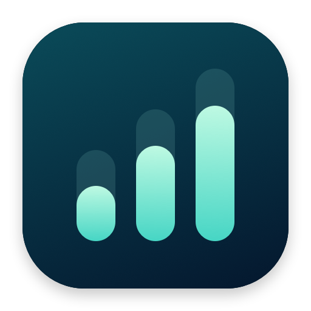
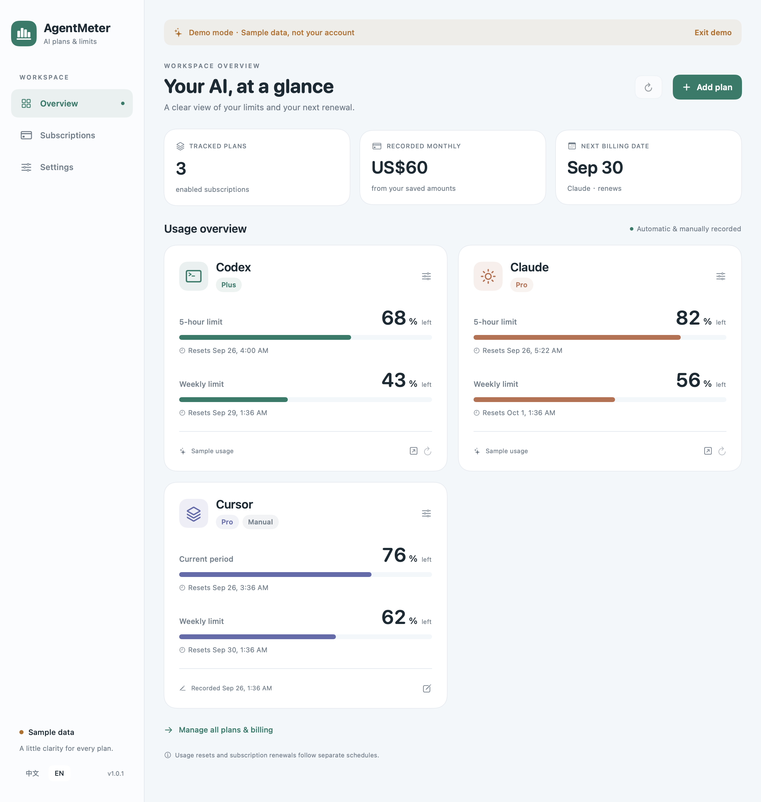
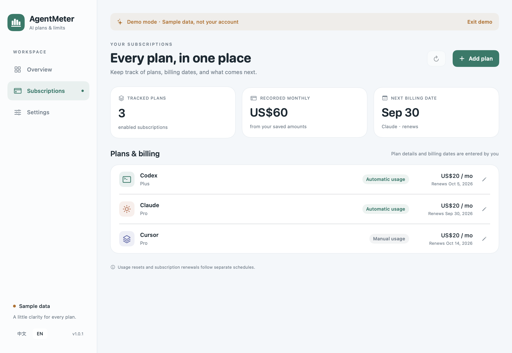
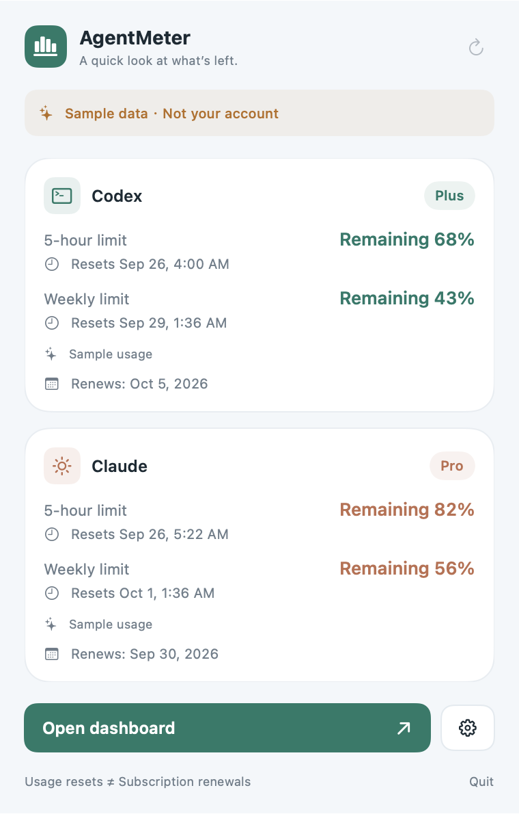

<p align="center">
  
</p>

<h1 align="center">AgentMeter</h1>

<p align="center">AI tool quotas and subscription dates, in one macOS dashboard.</p>

<p align="center">
  <a href="https://github.com/NginxL/AgentMeter/releases/latest"></a>
  <a href="https://github.com/NginxL/AgentMeter/actions/workflows/build.yml"></a>
  
  <a href="LICENSE"></a>
</p>

<p align="center"><strong>English</strong> · <a href="README.zh-CN.md">简体中文</a></p>

<p align="center">
  <a href="https://github.com/NginxL/AgentMeter/releases/latest"><strong>Download for macOS</strong></a> ·
  <a href="#getting-started">Getting started</a> ·
  <a href="docs/PRIVACY.md">Privacy</a> ·
  <a href="https://github.com/NginxL/AgentMeter/issues">Report an issue</a>
</p>

AgentMeter is a native SwiftUI app for viewing Codex and Claude quotas alongside manually tracked subscriptions and usage. Check each subscription's remaining quota, reset time, and read status from the menu bar, or open the dashboard to manage your records. Supported automatic sources use existing official client logins; your records stay on your Mac.

**Compatibility:** macOS 14 or later · Apple Silicon and Intel in one universal app · Simplified Chinese by default, switchable to English · no third-party runtime dependencies.

## Screenshots

<table>
  <tr><th align="center">Quota overview</th><th align="center">Subscription tracking</th></tr>
  <tr>
    <td align="center"><a href="docs/images/overview.png"></a></td>
    <td align="center"><a href="docs/images/subscriptions.png"></a></td>
  </tr>
  <tr>
    <td valign="top">Remaining quota, reset times, and data freshness in one overview.</td>
    <td valign="top">Built-in and custom subscriptions with manually entered renewal or expiry dates and monthly amounts.</td>
  </tr>
</table>

<p align="center"><strong>Menu bar at a glance</strong></p>
<p align="center"><a href="docs/images/menu.png"></a></p>
<p align="center">A compact summary for each enabled subscription, with quota readings, reset times, and clear manual, stale, or unavailable states. Open the dashboard for details.</p>

<p align="center"><sub>Actual app screenshots using labeled sample data. Plans, amounts, dates, and quota values are illustrative; they do not represent current provider offers or a live account. Click to view full size.</sub></p>

## What AgentMeter tracks

| Source | Automatic quota source | Manual tracking |
| --- | --- | --- |
| Codex | Quota windows, reset times, and available plan information through the official local Codex client | Subscription details; optional manual quota fallback |
| Claude | Quota windows and reset times from Anthropic's usage endpoint; available plan label from the existing Claude Code login | Subscription details; optional manual quota fallback |
| Any other tool | No automatic quota integration in v1 | Custom subscription entry and up to two manual quota windows |

Manual subscription fields include name, plan, renewal or expiry date, monthly amount, currency, and notes. Manual quota windows record used percentage and an optional reset time; unknown values can remain blank. The recorded-at timestamp updates when you save changes to the quota record. These readings are labeled as manual and do not refresh or reset themselves. You can switch Codex or Claude to manual tracking explicitly; an automatic read failure does not silently switch the source.

**All subscription dates are manual in v1.** Automatic quota reset times come from the supported source; manual quota reset times are entered by you. Neither is a billing date. AgentMeter does not scrape billing pages, infer subscription expiry from a quota reset, or convert token usage into an estimated API cost. Monthly totals add the amounts you enter and keep currencies separate; they are not provider invoices.

Quota availability depends on your login, plan, and the provider's current response. Unknown values remain unavailable. An integration is not a guarantee that every account or quota window is supported.

## Getting started

1. Download `AgentMeter-<version>-universal.zip` from the [latest release](https://github.com/NginxL/AgentMeter/releases/latest).
2. Unzip it and move `AgentMeter.app` into `/Applications` or `~/Applications`.
3. For automatic quotas, sign in through the official Codex or Claude Code client, then refresh the overview.
4. Edit subscription dates and monthly amounts. For manual tracking, enter the quota readings you want to record; add a custom entry for any other tool.

Codex requires a local `codex` executable. Claude uses the existing Claude Code credential file or its default macOS Keychain entry. If Keychain access needs approval, use AgentMeter's explicit Claude connection action; background refresh does not open a Keychain prompt. AgentMeter does not ask you to paste an API key or password.

> **Signing:** Current release builds are ad-hoc signed. They are not Apple Developer ID signed or notarized, so macOS may block a downloaded copy. You can [build from source](docs/DEVELOPMENT.md#local-build) locally. The build and installation instructions do not disable Gatekeeper.

## Everyday use

Click the AgentMeter menu bar icon to see each enabled subscription's remaining quota, reset time, and current read status. Manual readings retain their source label and recording time; stale or unavailable data stays visibly distinct. Open the dashboard to edit records or inspect details.

| Action or state | Behavior |
| --- | --- |
| Refresh | Read supported quotas using the current official local login. Repeated requests to a provider are limited to one attempt per minute. |
| Automatic refresh | Refresh every 15 minutes while the app is running; disable it in settings when you prefer manual updates. |
| Stale or failed data | Show freshness and error state. A cached reading is not a fresh provider response. |
| Manual tracking | Record subscription details and up to two quota windows; automatic refresh is skipped for that entry. |
| Demo mode | Explore the interface with sample data without reading credentials or refreshing quota sources. Demo edits do not replace your saved records. |

Each automatic provider follows one local login. Additional accounts can be recorded as manual subscriptions. The first launch uses Simplified Chinese; switch to English in settings.

## Updates

Choose **Check for Updates** in settings. AgentMeter queries this repository's latest GitHub release and opens the release page when a newer version is available. Download the ZIP, quit AgentMeter, and replace the app. Your local settings are retained.

Checks are manual. Version 1 does not download, overwrite, or relaunch the application automatically. Published ZIPs include a SHA-256 checksum file; see the [development guide](docs/DEVELOPMENT.md#packaging-and-releases) for verification.

## Privacy

AgentMeter has no account system, analytics service, or project backend. Subscription records and a sanitized quota cache are stored locally. Credentials are read only as needed for provider access and are never saved in AgentMeter settings, exported, or sent to GitHub.

Codex requests run through the official CLI, which controls its own authentication and network behavior. Claude usage requests go directly to Anthropic. Manual entries do not read credentials or send quota requests. Manual update checks go to GitHub. Read the [privacy and data-source guide](docs/PRIVACY.md) for credential sources, storage, and network boundaries.

## Development and contributing

```bash
git clone https://github.com/NginxL/AgentMeter.git
cd AgentMeter
bash scripts/test.sh
bash scripts/build.sh
```

The generated app is `dist/AgentMeter.app`. Building requires macOS 14+ and Apple Command Line Tools with Swift 5.9 or later. See [development](docs/DEVELOPMENT.md) for architecture, validation, and universal releases.

Issues and pull requests are welcome. Include the app version, macOS version, provider, and steps to reproduce. Remove account details and credentials from screenshots or logs. Keep English and Chinese documentation consistent.

## Acknowledgments and license

Inspired by [CodexBar](https://github.com/steipete/CodexBar). AgentMeter's code, interface, and icon are independently authored; see [NOTICE.md](NOTICE.md). The project is not affiliated with any supported service provider.

Released under the [MIT License](LICENSE).
