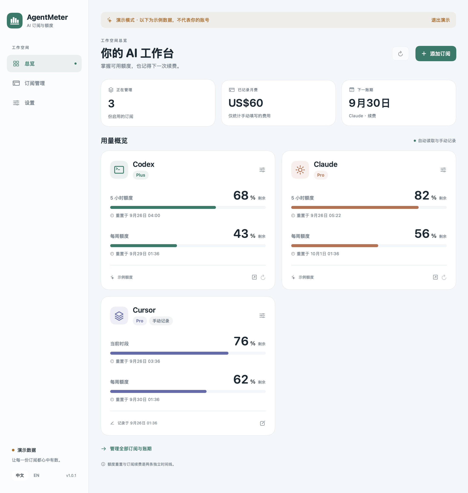
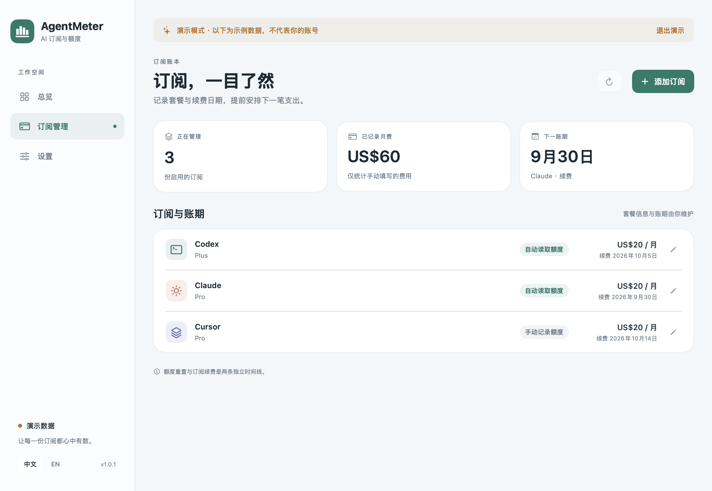
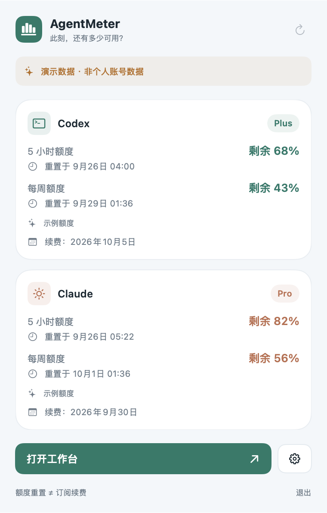

<p align="center">
  
</p>

<h1 align="center">AgentMeter</h1>

<p align="center">在一个 macOS 面板中查看 AI 工具额度与订阅日期。</p>

<p align="center">
  <a href="https://github.com/NginxL/AgentMeter/releases/latest"></a>
  <a href="https://github.com/NginxL/AgentMeter/actions/workflows/build.yml"></a>
  
  <a href="LICENSE"></a>
</p>

<p align="center"><a href="README.md">English</a> · <strong>简体中文</strong></p>

<p align="center">
  <a href="https://github.com/NginxL/AgentMeter/releases/latest"><strong>下载 macOS 版</strong></a> ·
  <a href="#开始使用">开始使用</a> ·
  <a href="docs/PRIVACY.zh-CN.md">隐私说明</a> ·
  <a href="https://github.com/NginxL/AgentMeter/issues">反馈问题</a>
</p>

AgentMeter 是原生 SwiftUI 应用，将 Codex、Claude 额度与手动登记的订阅和用量放在同一个面板中。菜单栏可直接查看每个订阅的剩余额度、重置时间和读取状态，工作台用于管理详细记录。支持的自动来源使用官方客户端已有的登录状态，记录保存在你的 Mac 上。

**兼容性：** macOS 14 及以上 · 同一个通用应用支持 Apple Silicon 和 Intel · 默认简体中文，可切换英文 · 无第三方运行时依赖。

## 界面预览

<table>
  <tr><th align="center">额度总览</th><th align="center">订阅管理</th></tr>
  <tr>
    <td align="center"><a href="docs/images/overview-zh.png"></a></td>
    <td align="center"><a href="docs/images/subscriptions-zh.png"></a></td>
  </tr>
  <tr>
    <td valign="top">集中查看剩余额度、重置时间和数据新鲜度。</td>
    <td valign="top">管理内置与自定义订阅，手动记录续费或到期日期、月度金额。</td>
  </tr>
</table>

<p align="center"><strong>菜单栏速览</strong></p>
<p align="center"><a href="docs/images/menu-zh.png"></a></p>
<p align="center">逐条查看已启用订阅的额度与重置时间，清楚区分手动、过期和不可用状态；需要详细信息时打开工作台。</p>

<p align="center"><sub>应用真实界面截图，使用明确标记的演示数据。套餐、金额、日期和额度均为示例，不代表服务商当前报价或真实账号数据。点击图片可查看原图。</sub></p>

## 支持哪些信息

| 来源 | 自动额度来源 | 手动管理 |
| --- | --- | --- |
| Codex | 通过本地官方 Codex 客户端读取额度窗口、重置时间和可用的套餐信息 | 订阅信息；可切换手动额度 |
| Claude | 从 Anthropic 用量接口读取额度窗口和重置时间，从已有的 Claude Code 登录信息读取可用的套餐名称 | 订阅信息；可切换手动额度 |
| 任意其他工具 | v1 无自动额度接入 | 自定义订阅入口，最多两个手动额度窗口 |

手动订阅字段包括名称、套餐、续费或到期日期、月度金额、币种和备注。手动额度窗口记录已用百分比与可选重置时间，未知值可留空；保存额度变更时更新记录时间。这些读数始终标记为手动，不会自行刷新或重置。Codex 和 Claude 均可主动切换为手动管理；自动读取失败不会悄悄更换数据来源。

**v1 的所有订阅日期均需手动填写。** 自动额度的重置时间来自支持的数据源，手动额度的重置时间由你填写，两者均不是账单日期。AgentMeter 不抓取账单页面，不将额度重置时间推断为订阅到期时间，也不把 token 用量换算成估算 API 费用。月度合计只汇总你填写的金额，并按币种分别统计，不代表服务商账单。

能否读取额度取决于登录状态、套餐和服务商当前返回的数据。未知值会保持为不可用；接入某个服务不意味着兼容所有账号和额度窗口。

## 开始使用

1. 从[最新发布页](https://github.com/NginxL/AgentMeter/releases/latest)下载 `AgentMeter-<版本>-universal.zip`。
2. 解压，将 `AgentMeter.app` 移入 `/Applications` 或 `~/Applications`。
3. 使用自动额度时，在官方 Codex 或 Claude Code 客户端中登录，再刷新总览。
4. 编辑订阅日期和月度金额。手动管理模式可填写需要记录的额度；其他工具可添加自定义订阅。

Codex 需要本地可用的 `codex` 可执行文件。Claude 使用 Claude Code 已有的凭据文件或默认 macOS 钥匙串条目。如果钥匙串需要授权，可使用 AgentMeter 中明确的 Claude 连接操作；后台刷新不会弹出钥匙串授权框。AgentMeter 不要求粘贴 API key 或密码。

> **签名状态：** 当前发行版采用临时签名（ad-hoc），未使用 Apple Developer ID 签名，也未公证。macOS 可能阻止打开下载的副本；你可以在本地[从源码构建](docs/DEVELOPMENT.zh-CN.md#本地构建)。构建脚本和安装说明不会关闭 Gatekeeper。

## 日常使用

点击 AgentMeter 菜单栏图标，即可查看每个已启用订阅的剩余额度、重置时间和当前读取状态。手动读数保留来源与记录时间，过期或不可用数据单独标记。编辑记录或查看详情时可打开工作台。

| 操作或状态 | 行为 |
| --- | --- |
| 刷新 | 使用官方客户端当前的本地登录状态读取支持的额度；同一服务商每分钟最多尝试一次。 |
| 自动刷新 | 应用运行时每 15 分钟刷新一次；可在设置中关闭，改为手动刷新。 |
| 数据过期或读取失败 | 显示数据新鲜度与错误状态；缓存读数不代表最新服务端响应。 |
| 手动管理 | 记录订阅信息和最多两个额度窗口；该条目不执行自动刷新。 |
| 演示模式 | 使用示例数据浏览界面，不读取凭据或刷新额度来源；演示中的编辑不会覆盖已保存记录。 |

每个自动接入的服务商跟随一个本地登录账号。其他账号可登记为手动订阅。首次启动默认使用简体中文，可在设置中切换英文。

## 更新

在设置中选择**检查更新**。AgentMeter 会查询本仓库最新的 GitHub Release；发现新版本后打开发布页。下载 ZIP、退出 AgentMeter，然后替换应用即可，已有本地设置会保留。

更新检查由你主动发起。v1 不自动下载、覆盖或重启应用。发布包附带 SHA-256 校验文件，验证方式见[开发说明](docs/DEVELOPMENT.zh-CN.md#打包与发布)。

## 隐私

AgentMeter 没有账号系统、分析服务或项目后端。订阅记录和去除账号标识的额度缓存保存在本地；凭据仅在访问服务商时按需使用，不保存到 AgentMeter 设置、不导出，也不发送给 GitHub。

Codex 请求经官方 CLI 执行，CLI 自行管理认证与网络行为。Claude 用量请求直接发送给 Anthropic。手动条目不读取凭据，也不发送额度请求。手动更新检查发送给 GitHub。凭据来源、存储内容与网络边界详见[隐私与数据来源说明](docs/PRIVACY.zh-CN.md)。

## 开发与贡献

```bash
git clone https://github.com/NginxL/AgentMeter.git
cd AgentMeter
bash scripts/test.sh
bash scripts/build.sh
```

应用产物位于 `dist/AgentMeter.app`。构建需要 macOS 14 及以上，以及提供 Swift 5.9 或更高版本的 Apple Command Line Tools。架构、验证与通用版本发布方法见[开发说明](docs/DEVELOPMENT.zh-CN.md)。

欢迎提交 Issue 和 Pull Request。反馈时请附应用版本、macOS 版本、涉及的服务商和复现步骤，并删除截图、日志中的账号信息与凭据。文档修改请保持中英文内容一致。

## 致谢与许可证

灵感来自 [CodexBar](https://github.com/steipete/CodexBar)。AgentMeter 的代码、界面和图标独立编写，详见 [NOTICE.md](NOTICE.md)。本项目与所支持服务的提供方没有隶属关系。

采用 [MIT 许可证](LICENSE)。
